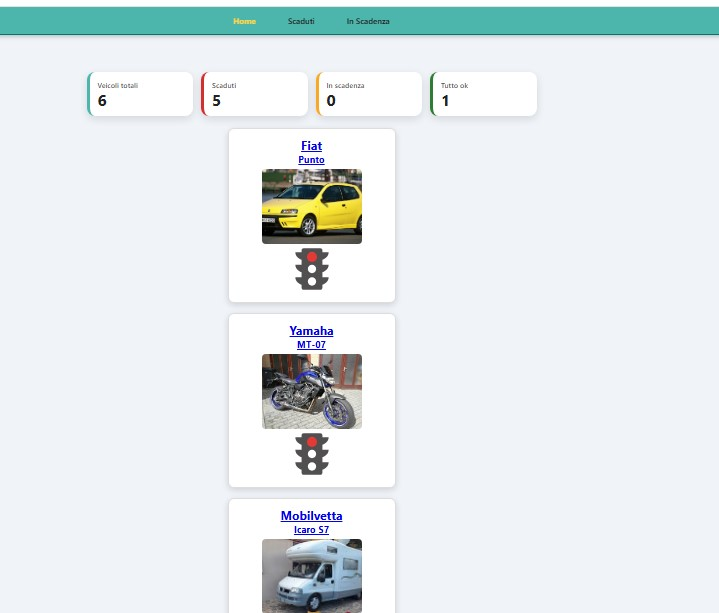
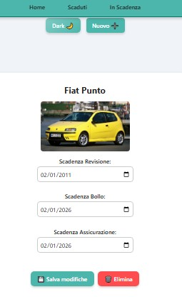
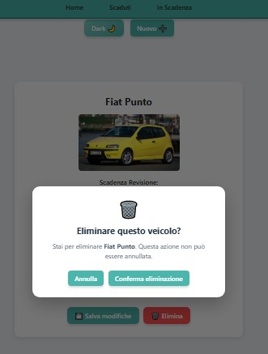

# My Garage

**My Garage** è una web app full-stack sviluppata con **React + Vite**, **Node.js/Express** e **MongoDB Atlas** per gestire veicoli e relative scadenze, come bollo, assicurazione e revisione.

Il progetto nasce come applicazione portfolio e ha l’obiettivo di mostrare un flusso completo di sviluppo web moderno: frontend responsive, routing, componenti riutilizzabili, backend REST API, database MongoDB, deploy online, gestione immagini, validazione dei form, feedback utente, notifiche globali, autenticazione utenti e persistenza dati.

---

## 🌐 Demo online

Puoi provare la web app qui:

👉 [Apri My Garage](https://my-garage-expiration.netlify.app/)

La demo è pubblicata online con:

* Frontend React su **Netlify**
* Backend Express su **Render**
* Database **MongoDB Atlas**

Il frontend comunica con il backend tramite API REST.

> Nota: il backend è pubblicato su Render con piano free. Al primo accesso può richiedere qualche secondo per riattivarsi dopo un periodo di inattività.

---

## 🔗 Link utili

* Demo Netlify: https://my-garage-expiration.netlify.app/
* Backend Render: https://my-garage-api.onrender.com
* Health check API: https://my-garage-api.onrender.com/api/health
* Repository GitHub: https://github.com/POrtalda/my-garage

Esempio risposta health check:

```json
{
  "status": "ok",
  "message": "My Garage API running"
}
```

---

## 📸 Screenshot

### Home e dashboard



### Dettaglio veicolo



### Conferma eliminazione



---

## 🚗 Funzionalità principali

* Registrazione e login utenti
* Logout dal menu principale
* Persistenza sessione utente con token JWT
* Gestione automatica della sessione scaduta o token non valido
* API veicoli protette tramite autenticazione
* Veicoli associati al singolo utente
* Ogni utente vede solo i propri veicoli
* Visualizzazione lista veicoli
* Dettaglio veicolo
* Aggiunta nuovo veicolo
* Upload immagine veicolo fino a 5 MB
* Modifica e rimozione immagine dalla pagina dettaglio
* Modifica delle scadenze
* Eliminazione veicolo con modale di conferma
* Filtro veicoli scaduti
* Filtro veicoli in scadenza
* Dashboard riepilogativa in Home
* Empty state personalizzati
* Stati di caricamento ed errore
* Pulsante “Riprova” in caso di errore API
* Validazione form con messaggi campo per campo
* Feedback durante aggiunta, modifica ed eliminazione
* Notifiche toast globali dopo login, registrazione, logout, sessione scaduta, aggiunta, modifica ed eliminazione veicolo
* Sistema di notifiche riutilizzabile con `ToastContext`
* Supporto Light/Dark mode
* Persistenza dati su MongoDB Atlas
* Fallback di lettura da localStorage se il backend non è raggiungibile
* Layout responsive ottimizzato per smartphone
* Supporto refresh diretto delle rotte su Netlify
* Refresh diretto su `/details/:id` senza falso messaggio “Veicolo non trovato”
* Backend CORS ristretto alla demo Netlify e all’ambiente locale

---

## 🧰 Stack utilizzato

### Frontend

* React 19
* Vite
* React Router
* React Icons
* Context API
* CSS modulare per componenti
* localStorage per preferenza tema, fallback dati e sessione utente
* Netlify

### Backend

* Node.js
* Express
* Mongoose
* MongoDB Atlas
* JWT
* bcryptjs
* dotenv
* cors
* Render

---

## 🏗️ Architettura full-stack

```text
Frontend Netlify
      │
      ▼
React + Vite
      │
      ▼
VITE_API_BASE_URL
      │
      ▼
Backend Render
Node.js + Express
      │
      ▼
MongoDB Atlas
```

Il frontend usa una variabile ambiente Vite per comunicare con il backend:

```env
VITE_API_BASE_URL=https://my-garage-api.onrender.com/api
```

In locale, se la variabile non è presente, viene usato il fallback:

```env
http://localhost:5000/api
```

---

## 📁 Struttura progetto

```text
my-garage/
├─ README.md
├─ .gitignore
├─ docs/
│  └─ images/
│     ├─ details-my-garage.png
│     ├─ home-my-garage.png
│     └─ modale-my-garage.jpg
├─ client/
│  ├─ .env.example
│  ├─ package.json
│  ├─ public/
│  │  └─ _redirects
│  └─ src/
│     ├─ main.jsx
│     ├─ App.jsx
│     ├─ App.css
│     ├─ routes/
│     │  └─ AppRoutes.jsx
│     ├─ services/
│     │  ├─ authApi.js
│     │  └─ vehiclesApi.js
│     ├─ context/
│     │  ├─ AuthContext.jsx
│     │  ├─ ThemeContext
│     │  └─ ToastContext.jsx
│     ├─ utils/
│     │  └─ vehicleDates.js
│     └─ components/
│        ├─ Auth/
│        ├─ DashboardSummary/
│        ├─ DarkLight/
│        ├─ DeleteConfirmationModal/
│        ├─ Details/
│        ├─ EmptyState/
│        ├─ Menu/
│        ├─ NewVehicle/
│        ├─ StateMessage/
│        ├─ Toast/
│        └─ Vehicle/
└─ server/
   ├─ .env.example
   ├─ package.json
   └─ src/
      ├─ app.js
      ├─ server.js
      ├─ config/
      │  └─ db.js
      ├─ controllers/
      │  ├─ authController.js
      │  ├─ healthController.js
      │  └─ vehicleController.js
      ├─ middleware/
      │  └─ authMiddleware.js
      ├─ models/
      │  ├─ User.js
      │  └─ Vehicle.js
      └─ routes/
         ├─ authRoutes.js
         ├─ healthRoutes.js
         └─ vehicleRoutes.js
```

---

## 🧭 Rotte frontend disponibili

| Rotta          | Descrizione                                      |
| -------------- | ------------------------------------------------ |
| `/`            | Home con lista veicoli e dashboard riepilogativa |
| `/login`       | Login utente                                     |
| `/register`    | Registrazione nuovo utente                       |
| `/expired`     | Veicoli con almeno una scadenza superata         |
| `/expiring`    | Veicoli con almeno una scadenza entro 30 giorni  |
| `/details/:id` | Dettaglio e modifica scadenze del veicolo        |

---

## 🔌 API backend

### Auth

| Metodo | Endpoint             | Descrizione              |
| ------ | -------------------- | ------------------------ |
| POST   | `/api/auth/register` | Registra un nuovo utente |
| POST   | `/api/auth/login`    | Login utente             |

### Health check

| Metodo | Endpoint      | Descrizione        |
| ------ | ------------- | ------------------ |
| GET    | `/api/health` | Verifica stato API |

### Veicoli

Gli endpoint `/api/vehicles` sono protetti e richiedono autenticazione tramite JWT.

Header richiesto:

```text
Authorization: Bearer <token>
```

| Metodo | Endpoint            | Descrizione                                 |
| ------ | ------------------- | ------------------------------------------- |
| GET    | `/api/vehicles`     | Recupera i veicoli dell’utente autenticato  |
| GET    | `/api/vehicles/:id` | Recupera un veicolo dell’utente autenticato |
| POST   | `/api/vehicles`     | Crea un nuovo veicolo associato all’utente  |
| PATCH  | `/api/vehicles/:id` | Aggiorna un veicolo dell’utente autenticato |
| DELETE | `/api/vehicles/:id` | Elimina un veicolo dell’utente autenticato  |

---

## 🔐 Autenticazione utenti

My Garage include una prima gestione completa dell’autenticazione utenti.

Sono disponibili:

* registrazione nuovo utente
* login utente
* logout dal menu principale
* salvataggio di utente e token JWT in `localStorage`
* invio automatico del token nelle richieste verso le API veicoli
* protezione backend delle rotte `/api/vehicles`
* gestione automatica di token non valido o sessione scaduta

Il backend genera un token JWT al momento di registrazione o login.

Il frontend salva le informazioni in:

```text
my-garage-auth
```

Le richieste verso le API veicoli includono l’header:

```text
Authorization: Bearer <token>
```

### Sessione scaduta o token non valido

Il frontend gestisce automaticamente eventuali errori di autenticazione restituiti dalle API veicoli.

Se il backend risponde con:

```text
401 Unauthorized
403 Forbidden
```

l’app esegue automaticamente:

* logout dell’utente
* rimozione della sessione salvata in `localStorage`
* svuotamento dei veicoli caricati nello stato locale
* visualizzazione del toast “Sessione scaduta”
* redirect alla pagina `/login`

Questo evita che l’utente resti bloccato nell’app con una sessione non più valida.

### Veicoli per utente

Ogni veicolo viene associato all’utente autenticato tramite il campo `user` nel modello `Vehicle`.

Questo significa che:

* un utente vede solo i propri veicoli
* un utente può aprire solo i propri dettagli veicolo
* un utente può modificare solo i propri veicoli
* un utente può eliminare solo i propri veicoli
* le API veicoli non sono più accessibili senza login

> Nota: i veicoli creati prima dell’introduzione dell’autenticazione non hanno il campo `user` e quindi non vengono più mostrati agli utenti loggati.

---

## 🔐 CORS backend

Il backend usa una configurazione CORS controllata.

Origini abilitate:

```text
https://my-garage-expiration.netlify.app
http://localhost:5173
```

Sono inoltre consentite le richieste senza `origin`, utili per:

* health check Render
* curl
* Postman
* test diretti dell’API

Questa configurazione evita di lasciare il backend aperto a qualsiasi dominio, mantenendo comunque funzionanti demo online e sviluppo locale.

---

## 💾 Gestione dati

I dati dei veicoli vengono salvati su **MongoDB Atlas** tramite backend Express.

Operazioni gestite:

* registrazione utente
* login utente
* logout lato frontend
* logout automatico in caso di sessione non valida
* generazione token JWT
* caricamento veicoli dell’utente autenticato
* aggiunta veicolo associato all’utente
* upload immagine veicolo
* modifica immagine veicolo
* rimozione immagine veicolo
* modifica scadenze
* eliminazione veicolo
* persistenza dati dopo refresh pagina
* mantenimento preferenza tema chiaro/scuro
* mantenimento sessione utente nel browser

Il `localStorage` viene usato per:

* preferenza tema Light/Dark
* dati utente e token JWT
* fallback di lettura di eventuali vecchi dati locali se il backend non è raggiungibile

Quando il token non è più valido, la sessione `my-garage-auth` viene rimossa automaticamente.

Il `localStorage` non salva più le immagini dei veicoli, per evitare errori di quota come:

```text
QuotaExceededError
```

---

## 🖼️ Gestione immagini

Per l’MVP/demo, le immagini dei veicoli vengono salvate come base64 nel database MongoDB.

Il limite attuale di upload è:

```text
5 MB
```

La pagina dettaglio permette di:

* visualizzare l’immagine del veicolo
* caricare una nuova immagine
* sostituire l’immagine esistente
* rimuovere l’immagine
* tornare alla Home dopo il salvataggio corretto delle modifiche

Questa soluzione è accettabile per una demo portfolio, ma in futuro potrà essere migliorata usando un servizio dedicato come:

* Cloudinary
* Amazon S3
* altro storage esterno per immagini

In quel caso il database salverebbe solo l’URL dell’immagine, rendendo l’app più leggera e scalabile.

---

## 🎨 UX e feedback utente

Il progetto include diversi miglioramenti pensati per rendere l’esperienza più chiara e curata:

* messaggi dedicati quando una lista è vuota
* messaggio di caricamento durante il recupero dati
* messaggio dedicato al possibile avvio lento del backend Render free
* messaggio di errore se il backend non risponde
* pulsante “Riprova” per rilanciare il caricamento dei veicoli
* fallback di lettura da localStorage se il backend non è raggiungibile
* validazione nel form di aggiunta veicolo
* validazione nella pagina dettaglio
* messaggi di errore nei form in caso di richiesta API fallita
* disabilitazione dei pulsanti durante salvataggio, modifica o eliminazione
* feedback “Salvataggio...” durante l’invio del form
* toast dopo login completato
* toast dopo registrazione completata
* toast dopo logout
* toast “Sessione scaduta” in caso di token non valido o scaduto
* redirect automatico al login quando la sessione non è più valida
* notifiche toast globali per confermare le azioni completate
* notifica dopo aggiunta veicolo completata
* notifica dopo modifica veicolo completata
* notifica dopo eliminazione veicolo completata
* sistema toast responsive e compatibile con dark mode
* menu dinamico in base allo stato di autenticazione
* visualizzazione utente loggato nel menu
* navigazione alla Home solo dopo salvataggio o cancellazione riusciti
* modale personalizzata per confermare l’eliminazione
* card veicolo responsive
* dashboard riepilogativa ottimizzata su mobile
* layout mobile migliorato per form, dettaglio veicolo e modale delete
* semaforo stato veicolo ricostruito in CSS per maggiore stabilità su smartphone

---

## 🔔 Notifiche globali

Il progetto include un sistema di notifiche toast globali basato su `ToastContext`.

Le notifiche vengono mostrate dopo le principali azioni completate correttamente o dopo eventi importanti dell’autenticazione:

* registrazione utente
* login utente
* logout utente
* sessione scaduta o token non valido
* aggiunta veicolo
* modifica veicolo
* eliminazione veicolo

Il sistema è composto da:

* componente riutilizzabile `Toast`
* provider globale `ToastProvider`
* funzione `showToast`
* stile responsive
* supporto Light/Dark mode

Questa struttura permette di riutilizzare facilmente le notifiche anche per future funzionalità, come errori API globali o conferme di salvataggio più avanzate.

---

## 🆕 Migliorie recenti

Le ultime iterazioni hanno migliorato la stabilità, la sicurezza e l’esperienza utente del progetto.

### Loading ed errori API

* migliorato il messaggio di caricamento iniziale
* aggiunto riferimento al possibile avvio lento del backend Render free
* aggiunto pulsante “Riprova” nel componente `StateMessage`
* collegata l’azione retry al nuovo caricamento dei veicoli
* migliorato il messaggio quando il backend non è raggiungibile
* mantenuto fallback con dati salvati nel browser

### Refresh diretto Details

È stato corretto il comportamento della rotta:

```text
/details/:id
```

Prima, facendo refresh diretto sulla pagina dettaglio, poteva comparire per un attimo il messaggio “Veicolo non trovato” mentre il backend stava ancora caricando i dati.

Ora viene mostrato lo stato di caricamento e il messaggio “Veicolo non trovato” compare solo dopo il completamento del caricamento.

### CORS ristretto

Il backend non usa più una configurazione CORS completamente aperta.

Le richieste browser sono consentite solo dalla demo Netlify e dall’ambiente locale di sviluppo.

### Feedback form

I form ora gestiscono meglio le azioni asincrone:

* il form nuovo veicolo attende la risposta del backend
* i pulsanti vengono disabilitati durante il salvataggio
* il form si chiude solo se il salvataggio va a buon fine
* gli errori vengono mostrati nel form
* la pagina Details naviga alla Home solo dopo aggiornamento o eliminazione riusciti

### Notifiche globali toast

È stato aggiunto un sistema di notifiche globali per rendere più evidente il risultato delle azioni principali.

Attualmente vengono mostrate notifiche di successo o di stato dopo:

* registrazione utente
* login utente
* logout utente
* sessione scaduta
* creazione veicolo
* aggiornamento veicolo
* eliminazione veicolo

Il sistema usa un `ToastContext` globale e un componente `Toast` riutilizzabile.

### Autenticazione utenti

È stata aggiunta la base completa per autenticazione utenti:

* registrazione
* login
* logout
* token JWT
* password hashata con `bcryptjs`
* persistenza sessione in `localStorage`
* menu dinamico in base allo stato login
* invio automatico del token nelle richieste veicoli

### API veicoli protette

Le API dei veicoli sono ora protette tramite middleware backend.

Il middleware:

* legge l’header `Authorization`
* verifica il token JWT
* carica l’utente autenticato
* rende disponibile l’utente in `req.user`

Le operazioni sui veicoli sono filtrate per utente autenticato.

### Gestione sessione scaduta

Il frontend ora riconosce gli errori `401` e `403` restituiti dalle API veicoli.

In caso di token non valido o sessione scaduta, l’app:

* esegue il logout automatico
* rimuove `my-garage-auth` dal `localStorage`
* svuota lo stato locale dei veicoli
* mostra un toast “Sessione scaduta”
* reindirizza l’utente a `/login`

Questa gestione rende il flusso di autenticazione più robusto e impedisce stati incoerenti con token non più validi.

---

## 🚀 Deploy full-stack

### Frontend Netlify

La demo frontend è pubblicata su Netlify:

```text
https://my-garage-expiration.netlify.app/
```

Variabile ambiente configurata su Netlify:

```env
VITE_API_BASE_URL=https://my-garage-api.onrender.com/api
```

Il progetto include il file:

```text
client/public/_redirects
```

Questo file permette il refresh diretto delle rotte gestite da React Router, come:

* `/login`
* `/register`
* `/expired`
* `/expiring`
* `/details/:id`

### Backend Render

Il backend Express è pubblicato su Render:

```text
https://my-garage-api.onrender.com
```

Health check:

```text
https://my-garage-api.onrender.com/api/health
```

Variabili ambiente principali lato backend:

```env
MONGO_URI=your_mongodb_atlas_connection_string
JWT_SECRET=your_jwt_secret
PORT=5000
```

### Database MongoDB Atlas

MongoDB Atlas viene usato per salvare:

* utenti
* password hashate
* veicoli associati agli utenti

---

## 🧪 Verifiche

Durante lo sviluppo vengono eseguiti:

```bash
npm run lint
npm run build
```

Per il frontend:

```bash
npm --prefix client run build
```

Per le modifiche solo documentali viene verificato anche:

```bash
git diff --check
```

---

## ✅ Test manuale consigliato

Dopo ogni modifica importante, è consigliato verificare manualmente i principali flussi dell’app.

### Checklist autenticazione

* aprire `/register`
* registrare un nuovo utente
* verificare toast di registrazione completata
* verificare redirect alla Home
* verificare presenza di `my-garage-auth` nel localStorage
* verificare utente visibile nel menu
* effettuare logout
* verificare toast di logout
* verificare redirect a `/login`
* effettuare login con credenziali corrette
* verificare toast di login completato
* verificare che le chiamate veicoli usino il token JWT
* aggiungere un veicolo da utente loggato
* aggiornare la pagina e verificare che il veicolo resti visibile
* modificare manualmente il token in `my-garage-auth`
* aggiornare la pagina
* verificare toast “Sessione scaduta”
* verificare redirect a `/login`
* verificare rimozione di `my-garage-auth` dal `localStorage`
* verificare che vecchi veicoli senza `user` non vengano mostrati

### Checklist generale

* aprire la Home e controllare la dashboard riepilogativa
* verificare la lista veicoli caricata dal backend per l’utente loggato
* verificare il messaggio di caricamento iniziale
* considerare il possibile avvio lento del backend Render free
* verificare il pulsante “Riprova” in caso di errore API
* aggiungere un veicolo senza foto
* aggiungere un veicolo con foto sotto 5 MB
* verificare la validazione dei campi obbligatori nel form nuovo veicolo
* verificare il feedback durante il salvataggio
* verificare la notifica toast dopo aggiunta veicolo
* aprire il dettaglio di un veicolo
* modificare le scadenze e salvare
* verificare che la navigazione alla Home avvenga dopo il salvataggio riuscito
* verificare la notifica toast dopo modifica veicolo
* modificare l’immagine dalla pagina Details
* rimuovere l’immagine dalla pagina Details
* eliminare un veicolo tramite modale di conferma
* verificare che la navigazione alla Home avvenga dopo eliminazione riuscita
* verificare la notifica toast dopo eliminazione veicolo
* verificare la chiusura manuale della notifica toast
* verificare la scomparsa automatica della notifica dopo qualche secondo
* verificare i toast in dark mode e su mobile
* aggiornare la pagina e verificare la persistenza dei dati
* cambiare tema chiaro/scuro e verificare che la preferenza resti salvata
* verificare che non compaia errore `QuotaExceededError`
* verificare il comportamento se il backend non è raggiungibile
* verificare il fallback sui vecchi dati locali del browser, quando disponibili

### Checklist API protette

* chiamare `/api/vehicles` senza token e verificare errore `401`
* effettuare login e ottenere token JWT
* verificare che `/api/vehicles` funzioni con header `Authorization`
* creare un veicolo da utente autenticato
* verificare che il veicolo venga associato all’utente
* verificare che un utente non possa vedere veicoli di altri utenti
* verificare che modifica ed eliminazione funzionino solo sui veicoli dell’utente autenticato
* modificare manualmente un token valido rendendolo non valido
* verificare che il backend risponda con errore auth
* verificare che il frontend esegua logout automatico e redirect a `/login`

### Checklist rotte Netlify

Verificare il refresh diretto delle rotte:

* `/`
* `/login`
* `/register`
* `/expired`
* `/expiring`
* `/details/:id`

In particolare, su `/details/:id` il refresh diretto non deve mostrare temporaneamente “Veicolo non trovato” mentre i dati sono ancora in caricamento.

### Checklist post-deploy full-stack

Dopo un deploy online, verificare:

* apertura Home dalla demo Netlify
* registrazione utente
* login utente
* logout utente
* caricamento veicoli dal backend Render con utente autenticato
* health check backend
* aggiunta veicolo con e senza immagine
* salvataggio su MongoDB Atlas
* notifica toast dopo aggiunta veicolo
* refresh pagina con dati persistenti
* modifica scadenze
* notifica toast dopo modifica veicolo
* modifica/rimozione immagine
* eliminazione veicolo
* notifica toast dopo eliminazione veicolo
* simulazione token non valido
* toast “Sessione scaduta”
* redirect automatico a `/login`
* filtri `/expired` e `/expiring`
* refresh diretto delle rotte
* comportamento del frontend in caso di backend non raggiungibile

---

## 🧑‍💻 Avvio in locale

Clona la repository:

```bash
git clone https://github.com/POrtalda/my-garage.git
cd my-garage
```

### Frontend

Entra nella cartella client:

```bash
cd client
```

Installa le dipendenze:

```bash
npm install
```

Crea il file `.env` partendo da `.env.example`:

```env
VITE_API_BASE_URL=http://localhost:5000/api
```

Avvia il frontend:

```bash
npm run dev
```

### Backend

In un secondo terminale, entra nella cartella server:

```bash
cd server
```

Installa le dipendenze:

```bash
npm install
```

Crea il file `.env` partendo da `.env.example`:

```env
MONGO_URI=your_mongodb_atlas_connection_string
JWT_SECRET=your_jwt_secret
PORT=5000
```

Avvia il backend:

```bash
npm run dev
```

Il backend sarà disponibile su:

```text
http://localhost:5000
```

Health check locale:

```text
http://localhost:5000/api/health
```

---

## 🌱 Stato del progetto

Il progetto è attualmente un **MVP full-stack online stabile con autenticazione utenti, API veicoli protette e gestione della sessione scaduta**.

Sono già presenti:

* frontend React pubblicato su Netlify
* backend Express pubblicato su Render
* database MongoDB Atlas
* registrazione, login e logout
* autenticazione utenti con JWT
* password hashate con `bcryptjs`
* menu dinamico in base allo stato login
* persistenza sessione in `localStorage`
* gestione automatica della sessione scaduta o token non valido
* API veicoli protette tramite middleware backend
* veicoli associati al singolo utente
* CRUD completo dei veicoli per utente autenticato
* upload immagine veicolo fino a 5 MB
* modifica e rimozione immagine dalla pagina Details
* validazione form
* feedback utente durante aggiunta, modifica ed eliminazione
* notifiche toast globali dopo login, registrazione, logout, sessione scaduta, aggiunta, modifica ed eliminazione
* sistema `ToastContext` riutilizzabile
* supporto Light/Dark mode
* responsive design
* gestione refresh rotte su Netlify
* refresh diretto su `/details/:id` corretto
* API base URL configurabile tramite variabile ambiente
* fallback localStorage per vecchi dati locali
* CORS backend ristretto alla demo Netlify e all’ambiente locale

Possibili sviluppi futuri:

* refresh token o scadenza sessione più evoluta
* pagina profilo utente
* estendere le notifiche toast anche a scadenze imminenti
* notifiche per scadenze imminenti
* dashboard più avanzata
* gestione offline/backend non raggiungibile più evoluta
* storage immagini con Cloudinary o Amazon S3
* test con Vitest / React Testing Library

---

## Notifiche email settimanali

My Garage include un sistema backend di notifiche settimanali per avvisare gli utenti quando uno o più veicoli hanno scadenze già superate o in arrivo entro 30 giorni.

Il backend espone un endpoint interno:

POST /api/notifications/weekly-expiry-email

L’endpoint è protetto tramite header:

x-cron-secret: <INTERNAL_CRON_SECRET>

La chiamata viene eseguita automaticamente da uno scheduler esterno ogni lunedì alle 09:00 Europe/Rome.

Per evitare invii duplicati nella stessa settimana, ogni email inviata viene registrata nel modello `NotificationLog` tramite chiave unica composta da:

- user
- type
- periodKey

Tipo notifica:

weekly-expiry-email

## 👨‍💻 Autore

Progetto sviluppato da **Paolo Ortalda** come parte del percorso di crescita nello sviluppo web frontend/full-stack.
