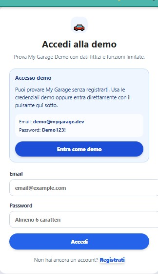
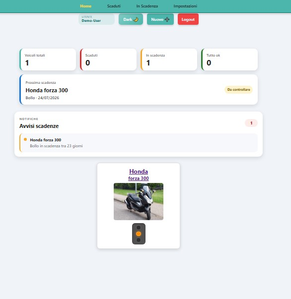
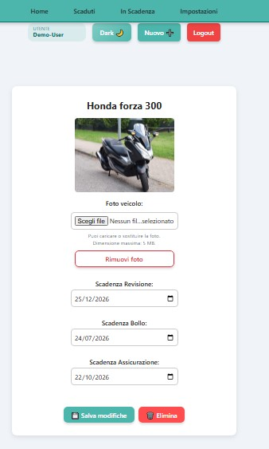
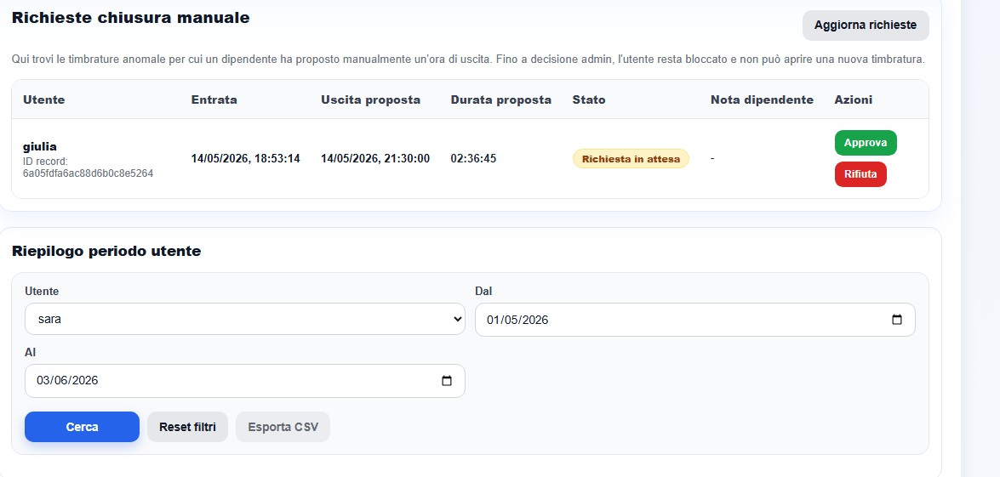

# My Garage

**My Garage** è una web app full-stack per gestire veicoli personali e relative scadenze, come **bollo**, **assicurazione** e **revisione**.

Il progetto è sviluppato con **React + Vite**, **Node.js/Express** e **MongoDB Atlas**. Nasce come progetto portfolio per mostrare un flusso completo di sviluppo web moderno: frontend responsive, autenticazione, API REST protette, persistenza dati, gestione immagini, notifiche, deploy online e ambiente demo separato.

---

## 🌐 Live Demo

Puoi provare la demo controllata qui:

👉 [Apri My Garage Demo](https://my-garage-demo.netlify.app/login)

### Credenziali demo

```text
Email: demo@mygarage.dev
Password: Demo123!
```

> La demo usa dati fittizi ed è separata dall'ambiente principale. È pensata per portfolio, recruiter e test guidati.

### Ambiente demo online

- Frontend React pubblicato su **Netlify**
- Backend Express pubblicato su **Render**
- Database separato su **MongoDB Atlas**
- Branch dedicato `demo`
- Registrazione pubblica disabilitabile
- Accesso rapido tramite account demo
- Limite massimo di veicoli configurabile

> Il backend demo è ospitato su Render. Al primo accesso, dopo un periodo di inattività, può impiegare qualche secondo per riattivarsi.

---

## 🔗 Link utili

- Demo Netlify: https://my-garage-demo.netlify.app/login
- Backend demo Render: https://my-garage-demo-api.onrender.com
- Health check API demo: https://my-garage-demo-api.onrender.com/api/health
- Repository GitHub: https://github.com/POrtalda/my-garage

Esempio risposta health check:

```json
{
  "status": "ok",
  "message": "My Garage API running"
}
```

---

## 📸 Screenshot

> Gli screenshot fanno riferimento alla versione demo controllata.

### Accesso demo



### Home e dashboard demo



### Dettaglio veicolo



### Nuovo veicolo / assistente guidato



---

## 🚗 Funzionalità principali

### Utenti e autenticazione

- Registrazione e login utenti
- Accesso rapido alla demo con account preconfigurato
- Registrazione pubblica disabilitabile in ambiente demo
- Logout dal menu principale
- Password hashate con `bcryptjs`
- Sessione utente persistita tramite JWT
- Gestione automatica di token scaduto o non valido
- Redirect automatico al login quando la sessione non è più valida

### Gestione veicoli

- Lista veicoli associata al singolo utente
- CRUD completo dei veicoli tramite API protette
- Dettaglio veicolo con modifica scadenze
- Upload immagine veicolo fino a 5 MB
- Modifica e rimozione immagine dalla pagina dettaglio
- Eliminazione veicolo con modale di conferma
- Ogni utente vede, modifica ed elimina solo i propri veicoli

### Scadenze e dashboard

- Dashboard riepilogativa in Home
- Filtro veicoli scaduti
- Filtro veicoli in scadenza entro 30 giorni
- Ordinamento dei veicoli per urgenza
- Logica date centralizzata in utility dedicate
- Priorità visibili solo quando ci sono scadenze scadute o imminenti

### Demo e assistente guidato

- Ambiente demo separato da produzione
- Limite massimo di veicoli configurabile in modalità demo
- Assistente guidato per ricavare informazioni utili partendo dalla targa
- Link a portali pubblici utili per controlli esterni

### Notifiche e preferenze

- Toast globali per login, registrazione, logout, sessione scaduta e azioni sui veicoli
- Email settimanali automatiche per scadenze scadute o in arrivo
- Preferenze utente per attivare/disattivare le email settimanali
- Notifiche push browser attivabili su singolo dispositivo
- Push collegate al job settimanale delle scadenze
- Anti-duplicato settimanale tramite `NotificationLog`

### UX e interfaccia

- Light/Dark mode
- Layout responsive ottimizzato per smartphone
- Empty state personalizzati
- Stati di caricamento ed errore
- Pulsante “Riprova” in caso di errore API
- Validazione form con messaggi campo per campo
- Feedback durante aggiunta, modifica ed eliminazione
- Supporto refresh diretto delle rotte su Netlify
- Refresh diretto su `/details/:id` senza falso messaggio “Veicolo non trovato”
- Menu dinamico in base allo stato di autenticazione
- Contrasto migliorato in dark mode
- Home più pulita: nessuna card “Tutto sotto controllo” quando non ci sono priorità

---

## 🧪 Ambiente demo

La demo è separata dall'ambiente principale.

```text
Branch demo        → demo
Frontend demo      → Netlify
Backend demo       → Render
Database demo      → MongoDB Atlas separato
Account demo       → demo@mygarage.dev
Registrazione      → disabilitabile in demo
Limite veicoli     → configurabile tramite DEMO_MAX_VEHICLES
```

### Variabili ambiente frontend demo

```env
VITE_API_BASE_URL=https://my-garage-demo-api.onrender.com/api
VITE_DEMO_MODE=true
```

### Variabili ambiente backend demo

```env
MONGO_URI=your_demo_mongodb_atlas_connection_string
JWT_SECRET=your_demo_jwt_secret
CLIENT_URL=https://my-garage-demo.netlify.app

DEMO_MODE=true
DEMO_REGISTRATION_ENABLED=false
DEMO_MAX_VEHICLES=2
```

> `DEMO_MAX_VEHICLES` può essere aumentato, ad esempio a `5`, quando la demo è pronta per essere condivisa.

---

## 🧰 Stack utilizzato

### Frontend

- React 19
- Vite
- React Router
- React Icons
- Context API
- Service Worker per notifiche push browser
- CSS modulare per componenti
- localStorage per tema, sessione utente e fallback dati
- Netlify

### Backend

- Node.js
- Express
- Mongoose
- MongoDB Atlas
- JWT
- bcryptjs
- Nodemailer
- web-push
- dotenv
- cors
- Render

---

## 🏗️ Architettura full-stack

```text
Frontend Netlify
      │
      ▼
React + Vite
      │
      ▼
VITE_API_BASE_URL
      │
      ▼
Backend Render
Node.js + Express
      │
      ▼
MongoDB Atlas
```

Il frontend usa una variabile ambiente Vite per comunicare con il backend:

```env
VITE_API_BASE_URL=https://my-garage-demo-api.onrender.com/api
```

In locale, se la variabile non è presente, viene usato il fallback:

```text
http://localhost:5000/api
```

---

## 📁 Struttura progetto

```text
my-garage/
├─ README.md
├─ .gitignore
├─ docs/
│  └─ images/
│     ├─ login-demo-my-garage.png
│     ├─ home-demo-my-garage.png
│     ├─ details-demo-my-garage.png
│     └─ new-vehicle-demo-my-garage.png
├─ client/
│  ├─ .env.example
│  ├─ package.json
│  ├─ public/
│  │  ├─ _redirects
│  │  └─ service-worker.js
│  └─ src/
│     ├─ main.jsx
│     ├─ App.jsx
│     ├─ App.css
│     ├─ routes/
│     │  └─ AppRoutes.jsx
│     ├─ services/
│     │  ├─ authApi.js
│     │  ├─ notificationPreferencesApi.js
│     │  ├─ plateLookupApi.js
│     │  ├─ pushNotificationsApi.js
│     │  └─ vehiclesApi.js
│     ├─ context/
│     │  ├─ AuthContext.jsx
│     │  ├─ ThemeContext.jsx
│     │  └─ ToastContext.jsx
│     ├─ utils/
│     │  ├─ pushNotifications.js
│     │  ├─ vehicleDates.js
│     │  └─ vehicleSorting.js
│     └─ components/
│        ├─ Auth/
│        ├─ DashboardSummary/
│        ├─ DarkLight/
│        ├─ DeleteConfirmationModal/
│        ├─ Details/
│        ├─ EmptyState/
│        ├─ ExpiryAlerts/
│        ├─ Menu/
│        ├─ NewVehicle/
│        ├─ NotificationSettings/
│        ├─ PrioritySummary/
│        ├─ StateMessage/
│        ├─ Toast/
│        └─ Vehicle/
└─ server/
   ├─ .env.example
   ├─ package.json
   └─ src/
      ├─ app.js
      ├─ server.js
      ├─ config/
      │  └─ db.js
      ├─ controllers/
      │  ├─ authController.js
      │  ├─ healthController.js
      │  ├─ notificationController.js
      │  ├─ plateLookupController.js
      │  └─ vehicleController.js
      ├─ middlewares/
      │  └─ authMiddleware.js
      ├─ models/
      │  ├─ NotificationLog.js
      │  ├─ PushSubscription.js
      │  ├─ User.js
      │  └─ Vehicle.js
      ├─ routes/
      │  ├─ authRoutes.js
      │  ├─ healthRoutes.js
      │  ├─ notificationRoutes.js
      │  ├─ plateLookupRoutes.js
      │  └─ vehicleRoutes.js
      └─ utils/
         ├─ email.js
         └─ expiryAlerts.js
```

---

## 🧭 Rotte frontend

| Rotta | Descrizione |
| --- | --- |
| `/` | Home con lista veicoli, dashboard e priorità scadenze |
| `/login` | Login utente e accesso rapido demo |
| `/register` | Registrazione nuovo utente, disabilitabile in demo |
| `/expired` | Veicoli con almeno una scadenza superata |
| `/expiring` | Veicoli con almeno una scadenza entro 30 giorni |
| `/details/:id` | Dettaglio e modifica scadenze del veicolo |
| `/impostazioni` | Preferenze notifiche email e push del dispositivo |

---

## 🔌 API backend

### Auth

| Metodo | Endpoint | Descrizione |
| --- | --- | --- |
| POST | `/api/auth/register` | Registra un nuovo utente, bloccabile in demo |
| POST | `/api/auth/login` | Login utente |
| GET | `/api/auth/me` | Recupera utente autenticato |
| GET | `/api/auth/me/notification-preferences` | Recupera preferenze notifiche |
| PATCH | `/api/auth/me/notification-preferences` | Aggiorna preferenze notifiche |

### Health check

| Metodo | Endpoint | Descrizione |
| --- | --- | --- |
| GET | `/api/health` | Verifica stato API |

### Veicoli

Gli endpoint `/api/vehicles` sono protetti e richiedono autenticazione tramite JWT.

Header richiesto:

```text
Authorization: Bearer <token>
```

| Metodo | Endpoint | Descrizione |
| --- | --- | --- |
| GET | `/api/vehicles` | Recupera i veicoli dell'utente autenticato |
| GET | `/api/vehicles/:id` | Recupera un veicolo dell'utente autenticato |
| POST | `/api/vehicles` | Crea un nuovo veicolo associato all'utente |
| PATCH | `/api/vehicles/:id` | Aggiorna un veicolo dell'utente autenticato |
| DELETE | `/api/vehicles/:id` | Elimina un veicolo dell'utente autenticato |

### Assistente targa

| Metodo | Endpoint | Descrizione |
| --- | --- | --- |
| POST | `/api/vehicles/plate-lookup` | Restituisce indicazioni guidate partendo dalla targa |

### Notifiche

| Metodo | Endpoint | Descrizione |
| --- | --- | --- |
| POST | `/api/notifications/weekly-expiry-email` | Job interno per email e push settimanali |
| GET | `/api/notifications/vapid-public-key` | Restituisce la chiave pubblica VAPID |
| POST | `/api/notifications/push-subscriptions` | Salva la subscription push del dispositivo |
| DELETE | `/api/notifications/push-subscriptions` | Disattiva la subscription push del dispositivo |
| POST | `/api/notifications/test-push` | Invia una push di test all'utente autenticato |

L'endpoint settimanale è interno e richiede l'header:

```text
x-cron-secret: <INTERNAL_CRON_SECRET>
```

---

## 🔐 Autenticazione utenti

My Garage include una gestione completa dell'autenticazione:

- registrazione nuovo utente
- login utente
- logout dal menu principale
- password hashata con `bcryptjs`
- token JWT
- salvataggio di utente e token JWT in `localStorage`
- invio automatico del token nelle richieste verso le API protette
- protezione backend delle rotte veicoli
- gestione automatica di token non valido o sessione scaduta

Il frontend salva la sessione in:

```text
my-garage-auth
```

Le richieste verso le API protette includono:

```text
Authorization: Bearer <token>
```

### Sessione scaduta o token non valido

Se il backend risponde con:

```text
401 Unauthorized
403 Forbidden
```

l'app esegue automaticamente:

- logout dell'utente
- rimozione della sessione salvata in `localStorage`
- svuotamento dei veicoli caricati nello stato locale
- visualizzazione del toast “Sessione scaduta”
- redirect alla pagina `/login`

### Veicoli per utente

Ogni veicolo è associato all'utente autenticato tramite il campo `user` nel modello `Vehicle`.

Questo significa che:

- un utente vede solo i propri veicoli
- un utente può aprire solo i propri dettagli veicolo
- un utente può modificare solo i propri veicoli
- un utente può eliminare solo i propri veicoli
- le API veicoli non sono accessibili senza login

---

## 🔐 CORS backend

Il backend usa una configurazione CORS controllata.

Origini abilitate:

```text
https://my-garage-expiration.netlify.app
https://my-garage-demo.netlify.app
http://localhost:5173
```

È inoltre possibile configurare l'origine frontend tramite:

```env
CLIENT_URL=https://my-garage-demo.netlify.app
```

Sono consentite anche le richieste senza `origin`, utili per:

- health check Render
- curl
- Postman
- test diretti dell'API

---

## 💾 Gestione dati

I dati vengono salvati su **MongoDB Atlas** tramite backend Express.

Operazioni gestite:

- registrazione utente
- login utente
- generazione token JWT
- caricamento veicoli dell'utente autenticato
- aggiunta veicolo associato all'utente
- upload immagine veicolo
- modifica immagine veicolo
- rimozione immagine veicolo
- modifica scadenze
- eliminazione veicolo
- preferenze notifiche email dell'utente
- subscription push browser per dispositivo
- storico invii settimanali con `NotificationLog`

Il `localStorage` viene usato per:

- preferenza tema Light/Dark
- dati utente e token JWT
- fallback di lettura di eventuali vecchi dati locali se il backend non è raggiungibile

Il `localStorage` non salva più le immagini dei veicoli, per evitare errori di quota come:

```text
QuotaExceededError
```

---

## 🖼️ Gestione immagini

Per l'MVP/demo, le immagini dei veicoli vengono salvate come base64 nel database MongoDB.

Il limite attuale di upload è:

```text
5 MB
```

La pagina dettaglio permette di:

- visualizzare l'immagine del veicolo
- caricare una nuova immagine
- sostituire l'immagine esistente
- rimuovere l'immagine
- tornare alla Home dopo il salvataggio corretto delle modifiche

Questa soluzione è accettabile per una demo portfolio. In futuro potrà essere migliorata usando uno storage dedicato, ad esempio:

- Cloudinary
- Amazon S3
- altro storage esterno per immagini

---

## 🔔 Sistema notifiche scadenze

My Garage include un sistema notifiche per aiutare l'utente a non dimenticare le scadenze dei propri veicoli.

Il sistema gestisce:

- email settimanali automatiche
- preferenze utente per attivare/disattivare le email
- notifiche push browser su PC e smartphone
- anti-duplicato settimanale per evitare invii ripetuti
- scheduler esterno tramite cron-job.org

### Email settimanali

Il backend espone un endpoint interno protetto:

```http
POST /api/notifications/weekly-expiry-email
```

L'endpoint è pensato per essere chiamato da cron-job.org una volta a settimana.

La chiamata richiede l'header:

```http
x-cron-secret: <INTERNAL_CRON_SECRET>
```

Il job controlla tutti gli utenti e verifica le scadenze dei veicoli:

- `taxExpiry`
- `insuranceExpiry`
- `inspectionExpiry`

Vengono generate notifiche per:

- scadenze già scadute
- scadenze in arrivo entro 30 giorni

### Preferenze utente

Ogni utente può attivare o disattivare le email settimanali dalla pagina:

```text
/impostazioni
```

Endpoint protetti usati dal frontend:

```http
GET /api/auth/me/notification-preferences
PATCH /api/auth/me/notification-preferences
```

Body valido per aggiornare la preferenza:

```json
{
  "weeklyExpiryEmail": {
    "enabled": false
  }
}
```

### Notifiche push browser

L'utente può attivare le notifiche push dalla pagina:

```text
/impostazioni
```

Le notifiche push sono legate al singolo dispositivo e al singolo browser.

Il frontend registra un Service Worker:

```text
client/public/service-worker.js
```

Endpoint protetti usati per la gestione push:

```http
GET /api/notifications/vapid-public-key
POST /api/notifications/push-subscriptions
DELETE /api/notifications/push-subscriptions
POST /api/notifications/test-push
```

### Variabili ambiente notifiche

```env
INTERNAL_CRON_SECRET=

SMTP_HOST=
SMTP_PORT=
SMTP_USER=
SMTP_PASS=
SMTP_FROM=
SMTP_SECURE=false
SMTP_TIMEOUT_MS=30000

VAPID_PUBLIC_KEY=
VAPID_PRIVATE_KEY=
VAPID_SUBJECT=mailto:your_sender_email
```

---

## 🎨 UX e feedback utente

Il progetto include diversi miglioramenti pensati per rendere l'esperienza più chiara e curata:

- accesso demo immediato dalla pagina login
- messaggi dedicati quando una lista è vuota
- messaggio di caricamento durante il recupero dati
- messaggio dedicato al possibile avvio lento del backend Render free
- messaggio di errore se il backend non risponde
- pulsante “Riprova” per rilanciare il caricamento dei veicoli
- validazione nel form di aggiunta veicolo
- validazione nella pagina dettaglio
- disabilitazione dei pulsanti durante salvataggio, modifica o eliminazione
- feedback “Salvataggio...” durante l'invio del form
- notifiche toast globali per confermare le azioni completate
- pagina `/impostazioni` per gestire email settimanali e notifiche push
- menu dinamico in base allo stato di autenticazione
- visualizzazione utente loggato nel menu
- modale personalizzata per confermare l'eliminazione
- card veicolo responsive
- dashboard riepilogativa ottimizzata su mobile
- layout mobile migliorato per form, dettaglio veicolo e modale delete
- semaforo stato veicolo ricostruito in CSS per maggiore stabilità su smartphone
- Home pulita: la sezione priorità appare solo quando ci sono scadenze da gestire

---

## 🆕 Migliorie recenti

Le ultime iterazioni hanno migliorato stabilità, manutenzione del codice e interfaccia utente.

### Refactor ordinamento veicoli

- Spostata la logica di ordinamento fuori da `AppRoutes.jsx`
- Creato `client/src/utils/vehicleSorting.js`
- Esportate le funzioni:
  - `getVehicleUrgencyRank`
  - `getNearestDeadlineTime`
  - `sortVehiclesByUrgency`
- `AppRoutes.jsx` importa ora `sortVehiclesByUrgency` dalla utility dedicata
- Comportamento invariato, codice più ordinato e riutilizzabile

### Cleanup Home e Menu

- Migliorato il contrasto del box utente in dark mode
- Rimossa la vecchia scritta “My Garage” che poteva comparire al refresh
- Rimossa la card “Tutto sotto controllo” quando non ci sono priorità
- La sezione priorità resta visibile solo per veicoli scaduti o in scadenza

### Ambiente demo controllato

- creato branch `demo`
- creato frontend demo separato su Netlify
- creato backend demo separato su Render
- creato database demo separato su MongoDB Atlas
- aggiunto supporto a `CLIENT_URL` per CORS dinamico
- aggiunta modalità backend demo tramite `DEMO_MODE`
- registrazione pubblica bloccabile tramite `DEMO_REGISTRATION_ENABLED`
- limite massimo veicoli configurabile tramite `DEMO_MAX_VEHICLES`
- aggiunto box “Accesso demo” nella pagina login
- aggiunto pulsante “Entra come demo”
- aggiunta variabile frontend `VITE_DEMO_MODE`

### Assistente guidato targa

- aggiunto flusso guidato per ricavare informazioni utili partendo dalla targa
- aggiunti link ufficiali per consultare portali pubblici
- migliorata l'esperienza di inserimento nuovo veicolo

### Sistema notifiche scadenze

- email settimanali automatiche tramite Brevo/Nodemailer
- scheduler esterno cron-job.org
- preferenze utente nella pagina `/impostazioni`
- notifiche push browser tramite Service Worker e Web Push
- subscription salvate su MongoDB
- push collegate al job settimanale delle scadenze
- anti-duplicato notifiche tramite `NotificationLog`

---

## 🚀 Deploy full-stack

### Frontend demo Netlify

La demo frontend è pubblicata su Netlify:

```text
https://my-garage-demo.netlify.app/login
```

Variabili ambiente configurate su Netlify demo:

```env
VITE_API_BASE_URL=https://my-garage-demo-api.onrender.com/api
VITE_DEMO_MODE=true
```

Il progetto include il file:

```text
client/public/_redirects
```

Questo file permette il refresh diretto delle rotte gestite da React Router.

### Backend demo Render

Il backend demo Express è pubblicato su Render:

```text
https://my-garage-demo-api.onrender.com
```

Health check:

```text
https://my-garage-demo-api.onrender.com/api/health
```

Variabili ambiente principali lato backend demo:

```env
MONGO_URI=your_demo_mongodb_atlas_connection_string
JWT_SECRET=your_demo_jwt_secret
CLIENT_URL=https://my-garage-demo.netlify.app

DEMO_MODE=true
DEMO_REGISTRATION_ENABLED=false
DEMO_MAX_VEHICLES=2
```

### Database demo MongoDB Atlas

MongoDB Atlas demo viene usato per salvare:

- utenti demo
- password hashate
- veicoli associati agli utenti demo
- log notifiche settimanali
- push subscription dei dispositivi

---

## 🧪 Verifiche

Durante lo sviluppo vengono eseguiti:

```bash
npm run lint
npm run build
```

Per il frontend:

```bash
npm --prefix client run build
```

Per il backend:

```bash
npm --prefix server run dev
```

Per le modifiche documentali viene verificato anche:

```bash
git diff --check
```

---

## ✅ Test manuale consigliato

Dopo ogni modifica importante è consigliato verificare manualmente i principali flussi dell'app.

### Checklist demo

- aprire `https://my-garage-demo.netlify.app/login`
- verificare il box “Accesso demo”
- cliccare “Entra come demo”
- verificare login corretto
- verificare caricamento veicoli demo
- provare apertura dettaglio veicolo
- provare aggiunta veicolo fino al limite configurato
- verificare errore al superamento del limite demo
- aprire `/register`
- verificare che la registrazione sia bloccata in demo

### Checklist autenticazione

- effettuare login con credenziali corrette
- verificare toast di login completato
- verificare presenza di `my-garage-auth` nel localStorage
- verificare utente visibile nel menu
- effettuare logout
- verificare toast di logout
- verificare redirect a `/login`
- modificare manualmente il token in `my-garage-auth`
- aggiornare la pagina
- verificare toast “Sessione scaduta”
- verificare redirect a `/login`
- verificare rimozione di `my-garage-auth` dal `localStorage`

### Checklist generale

- aprire la Home e controllare la dashboard riepilogativa
- verificare la lista veicoli caricata dal backend
- verificare il messaggio di caricamento iniziale
- aggiungere un veicolo senza foto
- aggiungere un veicolo con foto sotto 5 MB
- verificare la validazione dei campi obbligatori
- verificare il feedback durante il salvataggio
- aprire il dettaglio di un veicolo
- modificare le scadenze e salvare
- modificare l'immagine dalla pagina Details
- rimuovere l'immagine dalla pagina Details
- eliminare un veicolo tramite modale di conferma
- verificare i filtri `/expired` e `/expiring`
- verificare refresh diretto delle rotte
- verificare dark mode e responsive mobile
- verificare che la sezione priorità sparisca quando non ci sono scadenze critiche

### Checklist notifiche

- aprire `/impostazioni` da utente autenticato
- verificare il toggle delle email settimanali
- disattivare e riattivare le email settimanali
- attivare le notifiche push sul dispositivo corrente
- verificare la richiesta permesso del browser
- verificare il messaggio di conferma attivazione push
- disattivare le notifiche push dal dispositivo

---

## 🧑‍💻 Avvio in locale

Clona la repository:

```bash
git clone https://github.com/POrtalda/my-garage.git
cd my-garage
```

### Frontend

Entra nella cartella client:

```bash
cd client
```

Installa le dipendenze:

```bash
npm install
```

Crea il file `.env` partendo da `.env.example`:

```env
VITE_API_BASE_URL=http://localhost:5000/api
```

Avvia il frontend:

```bash
npm run dev
```

### Backend

In un secondo terminale, entra nella cartella server:

```bash
cd server
```

Installa le dipendenze:

```bash
npm install
```

Crea il file `.env` partendo da `.env.example`:

```env
MONGO_URI=your_mongodb_atlas_connection_string
JWT_SECRET=your_jwt_secret
PORT=5000
CLIENT_URL=http://localhost:5173
```

Avvia il backend:

```bash
npm run dev
```

Il backend sarà disponibile su:

```text
http://localhost:5000
```

Health check locale:

```text
http://localhost:5000/api/health
```

---

## 🌿 Branch strategy

Il progetto usa due branch principali:

```text
main  → ambiente principale / produzione
 demo → ambiente portfolio / demo controllata
```

Workflow consigliato:

```text
sviluppo e test su demo
        ↓
porting su main
        ↓
riallineamento demo a main
        ↓
cleanup branch temporanee
```

Ultimo checkpoint tecnico:

```text
main = demo = origin/main = origin/demo = origin/HEAD
Commit condiviso: 0ebcbe8
```

---

## 🌱 Stato del progetto

Il progetto è attualmente un **MVP full-stack online stabile**, con ambiente demo controllato, autenticazione utenti, API protette, gestione immagini, scadenze, preferenze utente e sistema notifiche completo.

Sono già presenti:

- frontend React pubblicato su Netlify
- backend Express pubblicato su Render
- database MongoDB Atlas
- ambiente demo separato da produzione
- accesso rapido demo
- registrazione pubblica bloccabile in demo
- limite veicoli configurabile in demo
- autenticazione utenti con JWT
- password hashate con `bcryptjs`
- menu dinamico in base allo stato login
- persistenza sessione in `localStorage`
- gestione automatica della sessione scaduta o token non valido
- API veicoli protette tramite middleware backend
- veicoli associati al singolo utente
- CRUD completo dei veicoli per utente autenticato
- assistente guidato per informazioni da targa
- upload immagine veicolo fino a 5 MB
- modifica e rimozione immagine dalla pagina Details
- ordinamento veicoli per urgenza
- validazione form
- feedback utente durante aggiunta, modifica ed eliminazione
- notifiche toast globali
- email settimanali automatiche per le scadenze veicoli
- preferenze utente per email settimanali
- notifiche push browser attivabili per dispositivo
- push integrate nel job settimanale
- anti-duplicato notifiche tramite `NotificationLog`
- supporto Light/Dark mode
- responsive design
- gestione refresh rotte su Netlify
- API base URL configurabile tramite variabile ambiente
- fallback localStorage per vecchi dati locali
- CORS backend ristretto agli ambienti autorizzati

---

## 🛣️ Roadmap

Possibili sviluppi futuri:

- seed automatico dati demo
- reset periodico ambiente demo
- inviti demo temporanei
- scadenza accesso demo
- refresh token o gestione sessione più evoluta
- pagina profilo utente
- storico notifiche visibile all'utente
- template email HTML più curato
- dashboard più avanzata
- storage immagini con Cloudinary o Amazon S3
- test con Vitest / React Testing Library
- test API backend più strutturati

---

## 👨‍💻 Autore

Progetto sviluppato da **Paolo Ortalda** come parte del percorso di crescita nello sviluppo web frontend/full-stack.
